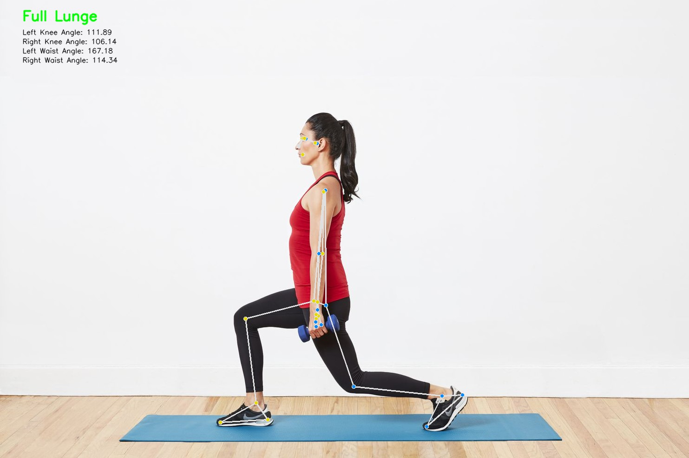

# Pose Estimation Classification using MediaPipe and OpenCV

Python Version: 3.11.*

## Description
This project is a simple pose estimation classification using MediaPipe and OpenCV. The application will classify the pose of the person in the live video feed into one of the following classes:
- Half Lunges (consists of L and R based on which knees is bent)
- Full Lunges 

The application will also display the keypoints of the person in the live video feed.

GIF Preview             |  Image Sample Preview
:-------------------------:|:-------------------------:
  |  

## Installation Guide
1. Make sure you have Python 3.11 installed on your system. If not, download it from [here](https://www.python.org/downloads/).
2. Clone the repository using the following command:
```bash
git clone https://github.com/vncnttan/lacak-task2-pose-classification-detection.git
```
3. Install the required packages using the following command:
```bash
pip install -r requirements.txt
```
4. Run the following command to start the application:
```bash
python main.py
```

## Under the Hood
The application uses MediaPipe Landmark to detect the keypoints of the person in the live video feed and mark them to the annotated fram. To classify the pose, the application uses the following keypoints:
- Left Shoulder
- Right Shoulder
- Left Hip
- Right Hip
- Left Knee
- Right Knee
- Left Ankle
- Right Ankle

to determine the angle of the following joints:
- Left Shoulder - Left Hip - Left Knee (Left Waist Angle)
- Right Shoulder - Right Hip - Right Knee (Right Waist Angle)
- Left Hip - Left Knee - Left Ankle (Left Knee Angle)
- Right Hip - Right Knee - Right Ankle (Right Knee Angle)

The classification is based on this criteria:
- Full Lunges: Both Knees are expected to bent (75 degrees to 115 degrees) with one of the waist angle (either left or right) is straight (160 degrees to 200 degrees). -> Should be pointed out if both waist angles are straight, then the person is kneeling, while if both waist angles are bent, then the person is squatting.
- Half Lunges: One of the knees is a little bent (115 degrees to 145 degrees) and the other knees is a little straight (120 to 180 degrees).

<video controls>
  <source src="./asset/video-preview-2.mp4" type="video/mp4">
</video>